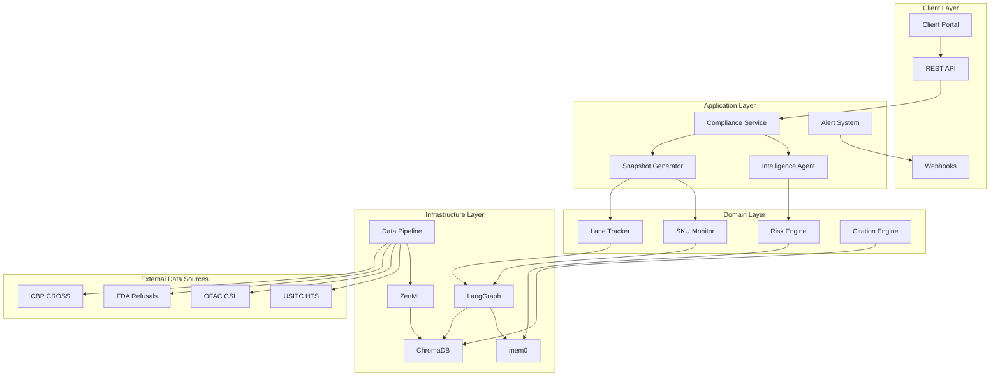
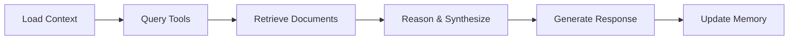
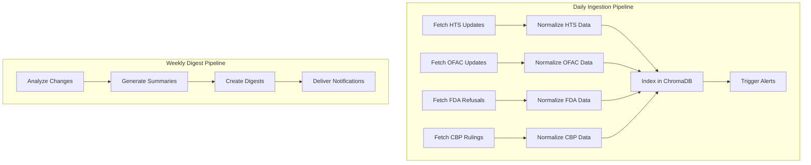

# Design Document

## Overview

The Compliance Intelligence Platform transforms the existing RAG application into a comprehensive compliance monitoring and intelligence system. The design leverages the current LangGraph, ChromaDB, mem0, and ZenML foundation while adding specialized compliance components for automated monitoring, risk assessment, and intelligent insights.

## Architecture

### High-Level Architecture



### Component Architecture

The platform extends the existing architecture with compliance-specific components:

1. **Compliance Service**: Orchestrates compliance operations and coordinates between components
2. **Intelligence Agent**: LangGraph-based agent for compliance reasoning and question answering
3. **Snapshot Generator**: Creates point-in-time compliance status reports
4. **Alert System**: Manages notifications and escalations
5. **Risk Engine**: Assesses and scores compliance risks using AI
6. **Citation Engine**: Tracks data sources and maintains audit trails

## Components and Interfaces

### 1. Compliance Service

**Purpose**: Central orchestrator for all compliance operations

**Key Methods**:
```python
class ComplianceService:
    def snapshot(client_id: str, sku_id: str, lane_id: str) -> SnapshotResponse
    def ask(client_id: str, question: str, context: dict) -> IntelligenceResponse
    def monitor_sku(client_id: str, sku_id: str, lanes: List[str]) -> MonitoringConfig
    def get_alerts(client_id: str, filters: dict) -> List[ComplianceEvent]
```

**Integration Points**:
- Extends existing `application/compliance_service/service.py`
- Uses existing LangGraph patterns from `chat_service/graph.py`
- Integrates with mem0 for client context storage

### 2. Intelligence Agent (LangGraph)

**Purpose**: AI-powered compliance reasoning and question answering

**Graph Structure**:


**Node Functions**:
- `load_client_context`: Retrieve client profile and preferences from mem0
- `query_compliance_tools`: Execute HTS, sanctions, refusals, and rulings tools in parallel
- `retrieve_documents`: Search compliance collections in ChromaDB
- `reason_and_synthesize`: Combine tool results with document context for reasoning
- `generate_response`: Create structured response with citations
- `update_memory`: Store insights and decisions in mem0

**Integration**:
- Extends existing `compliance_graph.py` with enhanced reasoning capabilities
- Reuses LangGraph patterns from `chat_service/graph.py`
- Integrates with compliance collections in ChromaDB

### 3. Data Pipeline (ZenML)

**Purpose**: Automated ingestion and processing of compliance data

**Pipeline Architecture**:


**Key Steps**:
- **Fetch Steps**: Retrieve data from external APIs with rate limiting and error handling
- **Normalize Steps**: Transform data into consistent schema with metadata enrichment
- **Index Steps**: Store in appropriate ChromaDB collections with proper metadata
- **Alert Steps**: Identify changes and trigger notifications for monitored items

**Integration**:
- Extends existing `zenml_pipelines/ingestion_pipeline.py`
- Uses existing ChromaDB client and collections pattern
- Integrates with compliance collections for specialized data storage

### 4. ChromaDB Collections

**Purpose**: Specialized storage for compliance data with semantic search

**Collection Structure**:
```python
# Compliance Collections
COMPLIANCE_HTS_NOTES = "compliance_hts_notes"      # HTS code details and requirements
COMPLIANCE_RULINGS = "compliance_rulings"          # CBP classification rulings
COMPLIANCE_REFUSALS = "compliance_refusal_summaries" # FDA/FSIS refusal patterns
COMPLIANCE_POLICY = "compliance_policy_snippets"   # Trade policy updates
COMPLIANCE_EVENTS = "compliance_events"            # Historical compliance events
```

**Metadata Schema**:
```python
# HTS Notes Metadata
{
    "hts_code": "8517.12.00",
    "chapter": "85",
    "duty_rate": "Free",
    "special_requirements": ["FCC", "Section 301"],
    "last_updated": "2025-01-20"
}

# Rulings Metadata
{
    "ruling_number": "N312345",
    "hts_code": "8517.12.00",
    "date": "2024-12-15",
    "topic": "cellular phones",
    "precedent_value": "high"
}
```

**Integration**:
- Extends existing `compliance_collections.py`
- Uses existing ChromaDB client infrastructure
- Implements semantic search with metadata filtering

### 5. mem0 Integration

**Purpose**: Store client profiles, preferences, and compliance context

**Memory Types**:
```python
# Client Profile Memory
{
    "user_id": "client_ABC",
    "memory_type": "profile",
    "content": "Client ABC imports electronics from China, prefers email alerts for duty changes >1%"
}

# SKU Context Memory
{
    "user_id": "client_ABC",
    "memory_type": "sku_context",
    "content": "SKU-123 is cellular phone HTS 8517.12.00, sourced from Shenzhen supplier"
}

# Decision Memory
{
    "user_id": "client_ABC", 
    "memory_type": "decision",
    "content": "Dismissed sanctions alert for Shanghai Telecom - different entity confirmed"
}
```

**Integration**:
- Uses existing `mem0_client.py` infrastructure
- Stores compliance-specific context and preferences
- Enables personalized compliance monitoring

## Data Models

### Core Domain Models

```python
# Client Profile
class ClientProfile(BaseModel):
    client_id: str
    name: str
    preferences: CompliancePreferences
    monitored_skus: List[SkuRef]
    monitored_lanes: List[LaneRef]
    created_at: datetime
    updated_at: datetime

# SKU Reference
class SkuRef(BaseModel):
    sku_id: str
    hts_code: str
    description: str
    supplier_country: str
    risk_level: RiskLevel

# Lane Reference  
class LaneRef(BaseModel):
    lane_id: str
    origin_port: str
    destination_port: str
    transport_mode: TransportMode
    active: bool

# Compliance Event
class ComplianceEvent(BaseModel):
    id: str
    client_id: str
    sku_id: str
    lane_id: str
    type: EventType
    risk_level: RiskLevel
    summary_md: str
    evidence: List[Evidence]
    created_at: datetime

# Snapshot Response
class SnapshotResponse(BaseModel):
    client_id: str
    sku_id: str
    lane_id: str
    tiles: Dict[str, Tile]
    sources: List[Evidence]
    generated_at: datetime
```

### Tool Integration Models

```python
# Tool Response Schema
class ToolResponse(BaseModel):
    success: bool
    data: Dict[str, Any]
    error: Optional[str]
    execution_time: float
    source_url: str
    last_updated: str

# Evidence Schema
class Evidence(BaseModel):
    source: str
    url: str
    snippet: str
    last_updated: str
    confidence: float
```

## Error Handling

### Error Categories

1. **Data Source Errors**: External API failures, rate limiting, data quality issues
2. **Processing Errors**: LLM failures, embedding generation errors, graph execution failures
3. **Storage Errors**: ChromaDB connection issues, mem0 storage failures
4. **Business Logic Errors**: Invalid SKU/lane combinations, missing client data

### Error Handling Strategy

```python
# Graceful Degradation
class ComplianceService:
    def snapshot(self, client_id: str, sku_id: str, lane_id: str) -> SnapshotResponse:
        try:
            # Full compliance check
            return self._generate_full_snapshot(client_id, sku_id, lane_id)
        except DataSourceError as e:
            # Partial snapshot with cached data
            logger.warning(f"Data source error: {e}")
            return self._generate_cached_snapshot(client_id, sku_id, lane_id)
        except Exception as e:
            # Minimal snapshot with error indication
            logger.error(f"Snapshot generation failed: {e}")
            return self._generate_error_snapshot(client_id, sku_id, lane_id, str(e))
```

### Circuit Breaker Pattern

```python
# Tool Circuit Breaker
class ComplianceTool:
    def __init__(self):
        self.circuit_breaker = CircuitBreaker(
            failure_threshold=5,
            recovery_timeout=300,
            expected_exception=HTTPError
        )
    
    def run(self, **kwargs):
        return self.circuit_breaker(self._run_impl)(**kwargs)
```

## Testing Strategy

### Unit Testing

**Domain Models**:
- Pydantic model validation
- Enum value constraints
- Data serialization/deserialization

**Tools**:
- Mock external API responses
- Test error handling and retries
- Validate response schemas

**LangGraph Nodes**:
- Test individual node functions
- Mock dependencies (mem0, ChromaDB)
- Validate state transformations

### Integration Testing

**End-to-End Workflows**:
- Complete snapshot generation
- Question answering with citations
- Alert generation and delivery

**Data Pipeline Testing**:
- ZenML pipeline execution
- Data ingestion and indexing
- Collection management

**API Testing**:
- FastAPI endpoint testing
- Authentication and authorization
- Error response validation

### Performance Testing

**Latency Requirements**:
- Snapshot generation: < 5 seconds (p95)
- Question answering: < 3 seconds (p95)
- Alert processing: < 1 second (p95)

**Load Testing**:
- Concurrent snapshot requests
- Bulk data ingestion
- Memory usage under load

### Test Data Strategy

**Mock Data Sources**:
```python
# HTS Mock Data
MOCK_HTS_RESPONSES = {
    "8517.12.00": {
        "description": "Cellular telephones",
        "duty_rate": "Free",
        "notes": ["FCC authorization required"]
    }
}

# OFAC Mock Data  
MOCK_OFAC_RESPONSES = {
    "Shanghai Telecom": {
        "match": True,
        "list": "Entity List",
        "date_added": "2025-01-15"
    }
}
```

**Test Client Data**:
```python
# Test Client Profile
TEST_CLIENT = {
    "client_id": "test_client_001",
    "monitored_skus": ["SKU-123", "SKU-456"],
    "monitored_lanes": ["CNSHA-USLAX-ocean"],
    "preferences": {
        "alert_threshold": 0.01,
        "notification_method": "email"
    }
}
```

## Security Considerations

### Authentication & Authorization

- JWT-based API authentication
- Role-based access control (RBAC)
- Client data isolation
- API rate limiting

### Data Protection

- Encryption at rest for sensitive compliance data
- Secure API key management for external services
- Audit logging for all compliance decisions
- Data retention policies

### External API Security

- API key rotation for external services
- Request signing for sensitive endpoints
- Rate limiting and circuit breakers
- Input validation and sanitization

## Performance Optimization

### Caching Strategy

```python
# Multi-level Caching
class ComplianceCache:
    def __init__(self):
        self.redis_cache = Redis()  # Fast cache for frequent queries
        self.mem0_cache = mem0_client  # Contextual cache for client data
        self.chromadb_cache = ChromaDB()  # Semantic cache for documents
```

### Parallel Processing

- Concurrent tool execution in LangGraph
- Async API calls to external services
- Batch processing for bulk operations
- Background task processing for alerts

### Resource Management

- Connection pooling for databases
- Memory management for large documents
- Disk space monitoring for ChromaDB
- CPU usage optimization for embeddings

## Monitoring and Observability

### Metrics Collection

```python
# Key Metrics
COMPLIANCE_METRICS = {
    "snapshot_latency": "p50, p95, p99 response times",
    "tool_success_rate": "% successful tool executions",
    "data_freshness": "age of compliance data sources",
    "alert_accuracy": "% of alerts that were actionable",
    "user_engagement": "API usage patterns and trends"
}
```

### Logging Strategy

- Structured logging with correlation IDs
- Compliance decision audit trails
- Performance metrics logging
- Error tracking and alerting

### Health Checks

- External API availability monitoring
- Database connection health
- Memory usage monitoring
- Pipeline execution status

This design provides a comprehensive foundation for transforming the existing RAG application into a production-ready Compliance Intelligence Platform while leveraging the existing infrastructure and patterns.