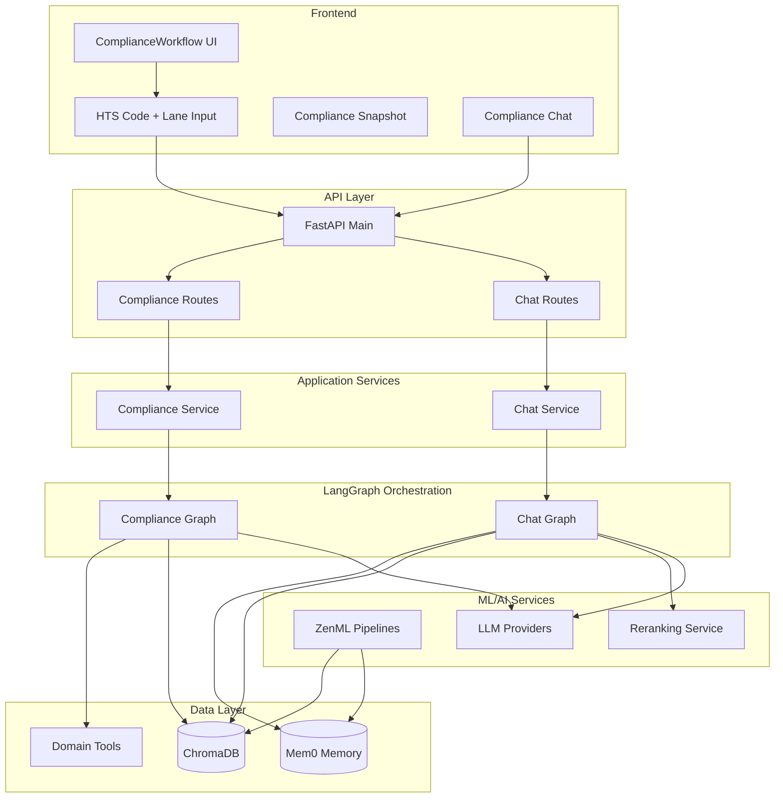

# Compliance Intelligence Platform - Backend Integration Guide

## Overview

This document explains how the integrated compliance workflow connects to all backend services: **Compliance Graph**, **Chat Graph**, **ZenML**, **Mem0**, and **ChromaDB**.

## Architecture Overview



## Integration Flows

### 1. Compliance Analysis Flow

#### Frontend → Backend

```typescript
// User enters HTS code and lane
handleInputSubmit("8517.12.00", "CN-US")
  ↓
// useComplianceWorkflow hook
fetchSnapshot({
  client_id: 'default-client',
  sku_id: 'sku-8517.12.00',
  lane_id: 'CN-US',
  hts_code: '8517.12.00'
})
  ↓
// API call to backend
POST /compliance/snapshot
```

#### Backend Processing

```python
# 1. API Route Handler
@router.post("/compliance/snapshot")
async def generate_snapshot(request: SnapshotRequest):
    result = compliance_service.snapshot(
        client_id=request.client_id,
        sku_id=request.sku_id,
        lane_id=request.lane_id
    )

# 2. Compliance Service
def snapshot(self, client_id: str, sku_id: str, lane_id: str):
    # Initialize LangGraph if needed
    if self.graph is None:
        self.graph = build_compliance_graph()
    
    # Execute compliance graph
    result = self.graph.invoke({
        "client_id": client_id,
        "sku_id": sku_id,
        "lane_id": lane_id,
        "question": None  # Snapshot mode
    })

# 3. Compliance Graph (LangGraph State Machine)
def validate_inputs_node(state: ComplianceState):
    # Validate required fields before processing
    if not all([state.get("client_id"), state.get("sku_id"), state.get("lane_id")]):
        return error_state

def execute_tools_failsoft(state: ComplianceState):
    # Execute domain tools sequentially with fail-soft error handling
    hts_result = HTSTool().run(hts_code="8517.12.00", lane_id="CN-US")
    sanctions_result = SanctionsTool().run(party_name="supplier", lane_id="CN-US")
    refusals_result = RefusalsTool().run(hts_code="8517.12.00", lane_id="CN-US")
    rulings_result = RulingsTool().run(hts_code="8517.12.00", lane_id="CN-US")
    # Each tool wrapped in try-except, continues on failure

def retrieve_context_node(state: ComplianceState):
    # Query ChromaDB for relevant compliance documents
    hts_notes = compliance_collections.search_hts_notes(
        query=f"HTS 8517.12.00",
        hts_code="8517.12.00",
        limit=2
    )

def generate_snapshot_partial(state: ComplianceState):
    # Create compliance tiles even with partial tool results
    tiles = {
        "hts_classification": create_hts_tile(hts_result),  # or error tile
        "sanctions_screening": create_sanctions_tile(sanctions_result),  # or error tile
        "refusal_history": create_refusals_tile(refusals_result),  # or error tile
        "cbp_rulings": create_rulings_tile(rulings_result)  # or error tile
    }
```

### 2. Chat Integration Flow

#### Frontend -> Backend

```typescript
// User asks question about compliance data
handleChatMessage("What are the risks for HTS 8517.12.00?")
  ↓
// Enhanced message with compliance context
sendChatMessage(message, {
  htsCode: "8517.12.00",
  laneId: "CN-US",
  hasComplianceData: true,
  snapshotSummary: {
    riskLevel: "low",
    alertCount: 0,
    tiles: ["hts_classification", "sanctions_screening"]
  }
})
  ↓
// API call with context
POST /chat
{
  "message": "Current compliance context:\n- HTS Code: 8517.12.00\n- Trade Lane: CN-US\n- Risk Level: low\n- Active Alerts: 0\n\nUser question: What are the risks for HTS 8517.12.00?",
  "conversation_history": [...]
}
```

#### Backend Processings

```python
# 1. Chat Service
def chat(self, message: str, conversation_history: list, user_id: str, session_id: str):
    # Execute chat graph (LangGraph)
    result = self.graph.invoke({
        "query": message,  # Enhanced with compliance context
        "user_id": user_id,
        "session_id": session_id
    })

# 2. Chat Graph (LangGraph State Machine)
def load_memories(state: MemoryState):
    # Query Mem0 for conversational memory
    memories = mem0_client.search(
        query=state["query"],
        user_id=state["user_id"],
        session_id=state["session_id"],
        limit=10
    )
    # Mem0 automatically handles:
    # - Recent conversation context
    # - Intent classification
    # - Entity extraction
    # - Episodic memory retrieval

def query_documents(state: MemoryState):
    # Query ChromaDB for RAG documents
    results = chroma_client.query_documents(
        query_text=state["query"],
        k=5
    )
    # Retrieves relevant compliance documents

def rerank_and_fuse(state: MemoryState):
    # Combine Mem0 memories + RAG documents
    all_docs = memory_docs + rag_docs
    
    # Rerank with cross-encoder
    if reranking_service.is_enabled():
        reranked_docs = reranking_service.rerank(
            query=query,
            documents=all_docs,
            top_k=5
        )

def generate_response(state: MemoryState):
    # Generate response with LLM
    llm = get_llm()
    response = llm.invoke(prompt_with_context)

def update_memories(state: MemoryState):
    # Store conversation in Mem0
    mem0_client.add(
        messages=[
            {"role": "user", "content": query},
            {"role": "assistant", "content": response}
        ],
        user_id=user_id,
        session_id=session_id
    )
    # Mem0 automatically handles:
    # - Deduplication
    # - Conversation summarization
    # - Long-term memory promotion
```

## Service Integrations

### ChromaDB (Shared Storage)

ChromaDB serves as the **central data hub** for multiple services:

```python
class ChromaDBClient:
    """Shared ChromaDB client managing multiple collections."""
    
    def initialize(self):
        # Single client instance shared across services
        self._client = chromadb.PersistentClient(path=config.chroma_db_path)
        
        # Collections:
        # 1. documents: RAG document embeddings
        # 2. mem0_memories: Mem0 conversational memory
        # 3. hts_notes: HTS compliance documents
        # 4. cbp_rulings: CBP rulings database
        # 5. sanctions_lists: Sanctions screening data
        # 6. refusal_summaries: Import refusal data
```

**Data Flow:**

1. **Compliance Graph** → Queries compliance-specific collections
2. **Chat Graph** → Queries document collection for RAG
3. **Mem0** → Uses shared client for memory storage
4. **ZenML Pipelines** → Ingests new data into collections

### Mem0 (Conversational Memory)

Mem0 provides **intelligent conversational memory** that understands compliance context:

```python
# When user asks compliance questions, Mem0 remembers:
mem0_client.add(
    messages=[
        {"role": "user", "content": "What are the risks for HTS 8517.12.00 from China?"},
        {"role": "assistant", "content": "For HTS 8517.12.00 (smartphones) from China, the main risks are: 1) Section 301 tariffs (25%), 2) Potential forced labor concerns, 3) FCC certification requirements..."}
    ],
    user_id="user123",
    session_id="compliance-session-456",
    metadata={
        "hts_code": "8517.12.00",
        "trade_lane": "CN-US",
        "compliance_context": True
    }
)

# Later queries automatically retrieve relevant context:
memories = mem0_client.search(
    query="Tell me about smartphone import requirements",
    user_id="user123"
)
# Returns previous HTS 8517.12.00 discussion with context
```

### ZenML (MLOps Pipeline)

ZenML orchestrates **data ingestion and model training pipelines**:

```python
# Compliance Data Ingestion Pipeline
@pipeline
def compliance_ingestion_pipeline(lookback_days: int = 7):
    # 1. Fetch new HTS updates
    hts_updates = fetch_hts_updates(lookback_days)
    
    # 2. Fetch new CBP rulings
    cbp_rulings = fetch_cbp_rulings(lookback_days)
    
    # 3. Fetch sanctions updates
    sanctions_updates = fetch_sanctions_updates(lookback_days)
    
    # 4. Process and embed documents
    processed_docs = process_compliance_documents([hts_updates, cbp_rulings, sanctions_updates])
    
    # 5. Store in ChromaDB
    store_in_chromadb(processed_docs)
    
    # 6. Update compliance collections
    update_compliance_collections(processed_docs)

# Memory Analytics Pipeline
@pipeline
def memory_analytics_pipeline(user_id: str):
    # 1. Analyze Mem0 usage patterns
    usage_stats = analyze_mem0_usage(user_id)
    
    # 2. Generate insights
    insights = generate_memory_insights(usage_stats)
    
    # 3. Optimize memory retention
    optimize_memory_retention(user_id, insights)
```

## Complete Integration Points

### Compliance Query Flow

```yml
User Input (HTS + Lane) 
  → API Route (/compliance/snapshot)
  → Compliance Service
  → Compliance Graph (LangGraph)
  → Domain Tools (HTS, Sanctions, Refusals, Rulings)
  → ChromaDB (compliance collections)
  → LLM (OpenAI/Anthropic/Groq)
  → Response (Compliance Snapshot)
```

### Chat Query Flow

```yml
User Message + Compliance Context
  → API Route (/chat)
  → Chat Service  
  → Chat Graph (LangGraph)
  → Mem0 (conversational memory)
  → ChromaDB (RAG documents)
  → Reranking Service (cross-encoder)
  → LLM (context-aware response)
  → Mem0 (store conversation)
  → Response (Contextual Answer)
```

### Data Pipeline Flow

```yml
ZenML Scheduler
  → Compliance Ingestion Pipeline
  → External APIs (HTS, CBP, OFAC, etc.)
  → Document Processing
  → Embedding Generation
  → ChromaDB Storage
  → Collection Updates
  → Mem0 Knowledge Updates
```

## Key Integration Benefits

### Shared Context

- **Compliance data** informs chat responses
- **Chat history** (via Mem0) provides user context
- **ChromaDB** serves as single source of truth
- **ZenML** keeps all data fresh and updated

### Intelligent Memory

- **Mem0** remembers user's compliance queries
- **Context-aware** responses based on previous discussions
- **Automatic summarization** of complex compliance topics
- **Long-term memory** for recurring compliance questions

### Scalable Architecture

- **LangGraph** orchestrates complex workflows
- **ChromaDB** handles vector similarity search
- **ZenML** manages data pipelines and model updates
- **Multiple LLM providers** for redundancy and optimization

This architecture creates a **tightly integrated, context-aware compliance assistant** that learns from user interactions, maintains comprehensive compliance knowledge, and provides intelligent, personalized responses based on both current compliance data and conversational history.
