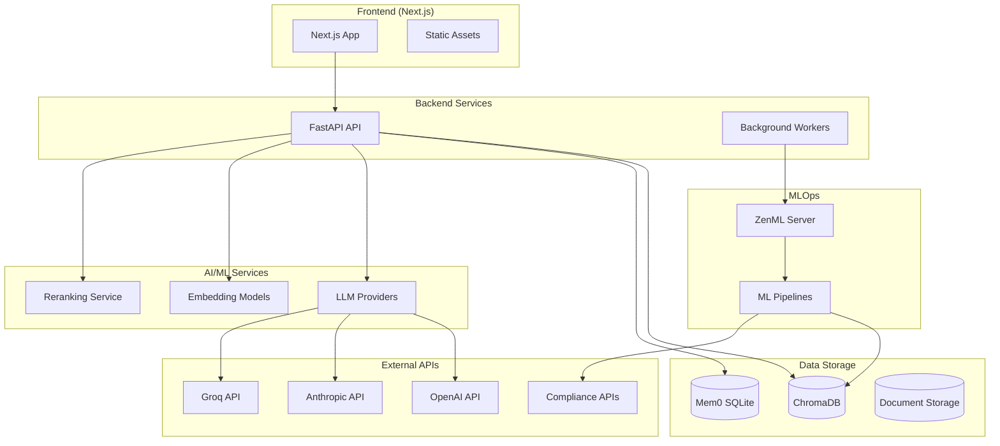

# Deployment Guide - Compliance Intelligence Platform

## Overview

This guide covers deploying the integrated compliance workflow with all backend services: FastAPI, ChromaDB, Mem0, ZenML, and the Next.js frontend.

## Architecture Overview



## Environment Setup

### 1. Environment Variables

Create environment files for each environment:

#### Backend (.env)
```bash
# API Configuration
API_HOST=0.0.0.0
API_PORT=8000
CORS_ORIGINS=["http://localhost:3000", "https://yourdomain.com"]

# LLM Providers
OPENAI_API_KEY=sk-your-openai-key
ANTHROPIC_API_KEY=your-anthropic-key
GROQ_API_KEY=your-groq-key

# Default LLM Configuration
DEFAULT_LLM_PROVIDER=openai
DEFAULT_LLM_MODEL=gpt-4o-mini
LLM_TEMPERATURE=0.1
LLM_MAX_TOKENS=1000

# ChromaDB Configuration
CHROMA_DB_PATH=./data/chroma_db
CHROMA_COLLECTION_NAME=documents

# Mem0 Configuration
MEM0_ENABLED=true
MEM0_VECTOR_STORE=chroma
MEM0_LLM_PROVIDER=openai
MEM0_LLM_MODEL=gpt-4o-mini
MEM0_EMBEDDER_MODEL=text-embedding-3-small
MEM0_HISTORY_DB_PATH=./data/mem0_history.db
MEM0_HISTORY_LIMIT=10

# Reranking Configuration
ENABLE_RERANKING=true
RERANKER_MODEL=cross-encoder/ms-marco-MiniLM-L-6-v2
RERANK_TOP_K=5

# Document Processing
DOCUMENTS_PATH=./data/documents
CHUNK_SIZE=1000
CHUNK_OVERLAP=200
RETRIEVAL_K=5

# ZenML Configuration
ZENML_ENABLED=true
ZENML_SERVER_URL=http://localhost:8080

# Evaluation Configuration
ENABLE_EVALUATION=false
RAGAS_METRICS=["faithfulness", "answer_relevance", "context_precision"]
```

#### Frontend (.env.local)
```bash
# API Configuration
NEXT_PUBLIC_API_URL=http://localhost:8000
NEXT_PUBLIC_API_TIMEOUT=10000

# Debug Configuration
NEXT_PUBLIC_ENABLE_DEBUG=false
NEXT_PUBLIC_DEBUG_NAVIGATION=false

# Chat Configuration
NEXT_PUBLIC_CHAT_ENABLED=true
NEXT_PUBLIC_CHAT_API_URL=http://localhost:8000/chat

# Upload Configuration
NEXT_PUBLIC_UPLOAD_MAX_SIZE=10485760
NEXT_PUBLIC_UPLOAD_ALLOWED_TYPES=.pdf,.txt,.csv,.epub
```

### 2. Production Environment Variables

#### Backend (.env.production)
```bash
# API Configuration
API_HOST=0.0.0.0
API_PORT=8000
CORS_ORIGINS=["https://yourdomain.com"]

# Database URLs (Production)
CHROMA_DB_PATH=/app/data/chroma_db
MEM0_HISTORY_DB_PATH=/app/data/mem0_history.db
DOCUMENTS_PATH=/app/data/documents

# Security
DEBUG=false
LOG_LEVEL=INFO

# Performance
WORKERS=4
MAX_CONCURRENT_REQUESTS=100

# External Services
ZENML_SERVER_URL=https://zenml.yourdomain.com
```

#### Frontend (.env.production)
```bash
# API Configuration
NEXT_PUBLIC_API_URL=https://api.yourdomain.com
NEXT_PUBLIC_API_TIMEOUT=15000

# Production Settings
NEXT_PUBLIC_ENABLE_DEBUG=false
NODE_ENV=production
```

## Docker Deployment

### 1. Backend Dockerfile

```dockerfile
# Backend Dockerfile
FROM python:3.11-slim

WORKDIR /app

# Install system dependencies
RUN apt-get update && apt-get install -y \
    build-essential \
    curl \
    && rm -rf /var/lib/apt/lists/*

# Install uv for fast Python package management
RUN pip install uv

# Copy requirements
COPY pyproject.toml uv.lock ./

# Install Python dependencies
RUN uv sync --frozen

# Copy application code
COPY src/ ./src/
COPY data/ ./data/

# Create data directories
RUN mkdir -p /app/data/chroma_db /app/data/documents /app/data/logs

# Expose port
EXPOSE 8000

# Health check
HEALTHCHECK --interval=30s --timeout=30s --start-period=5s --retries=3 \
    CMD curl -f http://localhost:8000/health || exit 1

# Run application
CMD ["uv", "run", "uvicorn", "src.exim_agent.infrastructure.api.main:app", "--host", "0.0.0.0", "--port", "8000"]
```

### 2. Frontend Dockerfile

```dockerfile
# Frontend Dockerfile
FROM node:18-alpine AS deps

WORKDIR /app
COPY package*.json ./
RUN npm ci --only=production

FROM node:18-alpine AS builder

WORKDIR /app
COPY . .
COPY --from=deps /app/node_modules ./node_modules

# Build application
RUN npm run build

FROM node:18-alpine AS runner

WORKDIR /app

# Create non-root user
RUN addgroup --system --gid 1001 nodejs
RUN adduser --system --uid 1001 nextjs

# Copy built application
COPY --from=builder /app/.next/standalone ./
COPY --from=builder /app/.next/static ./.next/static
COPY --from=builder --chown=nextjs:nodejs /app/.next/standalone ./

USER nextjs

EXPOSE 3000

ENV PORT 3000
ENV HOSTNAME "0.0.0.0"

# Health check
HEALTHCHECK --interval=30s --timeout=30s --start-period=5s --retries=3 \
    CMD curl -f http://localhost:3000/api/health || exit 1

CMD ["node", "server.js"]
```

### 3. Docker Compose

```yaml
# docker-compose.yml
version: '3.8'

services:
  # Backend API
  backend:
    build:
      context: .
      dockerfile: Dockerfile
    ports:
      - "8000:8000"
    environment:
      - API_HOST=0.0.0.0
      - API_PORT=8000
      - CHROMA_DB_PATH=/app/data/chroma_db
      - MEM0_HISTORY_DB_PATH=/app/data/mem0_history.db
    volumes:
      - ./data:/app/data
      - ./logs:/app/logs
    depends_on:
      - zenml
    restart: unless-stopped
    healthcheck:
      test: ["CMD", "curl", "-f", "http://localhost:8000/health"]
      interval: 30s
      timeout: 10s
      retries: 3

  # Frontend
  frontend:
    build:
      context: ./frontend
      dockerfile: Dockerfile
    ports:
      - "3000:3000"
    environment:
      - NEXT_PUBLIC_API_URL=http://backend:8000
    depends_on:
      - backend
    restart: unless-stopped
    healthcheck:
      test: ["CMD", "curl", "-f", "http://localhost:3000"]
      interval: 30s
      timeout: 10s
      retries: 3

  # ZenML Server (Optional)
  zenml:
    image: zenmldocker/zenml-server:latest
    ports:
      - "8080:8080"
    environment:
      - ZENML_STORE_URL=sqlite:///zenml/zenml.db
    volumes:
      - zenml_data:/zenml
    restart: unless-stopped

  # Nginx Reverse Proxy
  nginx:
    image: nginx:alpine
    ports:
      - "80:80"
      - "443:443"
    volumes:
      - ./nginx.conf:/etc/nginx/nginx.conf
      - ./ssl:/etc/nginx/ssl
    depends_on:
      - frontend
      - backend
    restart: unless-stopped

volumes:
  zenml_data:
```

### 4. Nginx Configuration

```nginx
# nginx.conf
events {
    worker_connections 1024;
}

http {
    upstream backend {
        server backend:8000;
    }
    
    upstream frontend {
        server frontend:3000;
    }

    # Frontend
    server {
        listen 80;
        server_name yourdomain.com;
        
        location / {
            proxy_pass http://frontend;
            proxy_set_header Host $host;
            proxy_set_header X-Real-IP $remote_addr;
            proxy_set_header X-Forwarded-For $proxy_add_x_forwarded_for;
            proxy_set_header X-Forwarded-Proto $scheme;
        }
    }

    # Backend API
    server {
        listen 80;
        server_name api.yourdomain.com;
        
        location / {
            proxy_pass http://backend;
            proxy_set_header Host $host;
            proxy_set_header X-Real-IP $remote_addr;
            proxy_set_header X-Forwarded-For $proxy_add_x_forwarded_for;
            proxy_set_header X-Forwarded-Proto $scheme;
            
            # CORS headers
            add_header Access-Control-Allow-Origin "https://yourdomain.com";
            add_header Access-Control-Allow-Methods "GET, POST, OPTIONS";
            add_header Access-Control-Allow-Headers "Content-Type, Authorization";
        }
    }
}
```

## Cloud Deployment

### 1. AWS Deployment

#### ECS Task Definition
```json
{
  "family": "compliance-intelligence",
  "networkMode": "awsvpc",
  "requiresCompatibilities": ["FARGATE"],
  "cpu": "1024",
  "memory": "2048",
  "executionRoleArn": "arn:aws:iam::account:role/ecsTaskExecutionRole",
  "taskRoleArn": "arn:aws:iam::account:role/ecsTaskRole",
  "containerDefinitions": [
    {
      "name": "backend",
      "image": "your-account.dkr.ecr.region.amazonaws.com/compliance-backend:latest",
      "portMappings": [
        {
          "containerPort": 8000,
          "protocol": "tcp"
        }
      ],
      "environment": [
        {
          "name": "CHROMA_DB_PATH",
          "value": "/app/data/chroma_db"
        }
      ],
      "mountPoints": [
        {
          "sourceVolume": "data",
          "containerPath": "/app/data"
        }
      ],
      "logConfiguration": {
        "logDriver": "awslogs",
        "options": {
          "awslogs-group": "/ecs/compliance-intelligence",
          "awslogs-region": "us-east-1",
          "awslogs-stream-prefix": "backend"
        }
      }
    }
  ],
  "volumes": [
    {
      "name": "data",
      "efsVolumeConfiguration": {
        "fileSystemId": "fs-12345678"
      }
    }
  ]
}
```

#### CloudFormation Template
```yaml
# cloudformation.yml
AWSTemplateFormatVersion: '2010-09-09'
Description: 'Compliance Intelligence Platform Infrastructure'

Resources:
  # VPC and Networking
  VPC:
    Type: AWS::EC2::VPC
    Properties:
      CidrBlock: 10.0.0.0/16
      EnableDnsHostnames: true
      EnableDnsSupport: true

  # ECS Cluster
  ECSCluster:
    Type: AWS::ECS::Cluster
    Properties:
      ClusterName: compliance-intelligence

  # Application Load Balancer
  ALB:
    Type: AWS::ElasticLoadBalancingV2::LoadBalancer
    Properties:
      Type: application
      Scheme: internet-facing
      Subnets: 
        - !Ref PublicSubnet1
        - !Ref PublicSubnet2

  # EFS for persistent storage
  EFS:
    Type: AWS::EFS::FileSystem
    Properties:
      PerformanceMode: generalPurpose
      ThroughputMode: provisioned
      ProvisionedThroughputInMibps: 100

  # RDS for ZenML (Optional)
  ZenMLDatabase:
    Type: AWS::RDS::DBInstance
    Properties:
      DBInstanceClass: db.t3.micro
      Engine: postgres
      MasterUsername: zenml
      AllocatedStorage: 20
```

### 2. Google Cloud Deployment

#### Cloud Run Configuration
```yaml
# cloud-run.yml
apiVersion: serving.knative.dev/v1
kind: Service
metadata:
  name: compliance-backend
  annotations:
    run.googleapis.com/ingress: all
spec:
  template:
    metadata:
      annotations:
        run.googleapis.com/cpu-throttling: "false"
        run.googleapis.com/memory: "2Gi"
        run.googleapis.com/cpu: "1000m"
    spec:
      containers:
      - image: gcr.io/your-project/compliance-backend:latest
        ports:
        - containerPort: 8000
        env:
        - name: CHROMA_DB_PATH
          value: "/app/data/chroma_db"
        volumeMounts:
        - name: data
          mountPath: /app/data
      volumes:
      - name: data
        persistentVolumeClaim:
          claimName: compliance-data
```

### 3. Kubernetes Deployment

```yaml
# k8s-deployment.yml
apiVersion: apps/v1
kind: Deployment
metadata:
  name: compliance-backend
spec:
  replicas: 3
  selector:
    matchLabels:
      app: compliance-backend
  template:
    metadata:
      labels:
        app: compliance-backend
    spec:
      containers:
      - name: backend
        image: compliance-backend:latest
        ports:
        - containerPort: 8000
        env:
        - name: CHROMA_DB_PATH
          value: "/app/data/chroma_db"
        volumeMounts:
        - name: data
          mountPath: /app/data
        resources:
          requests:
            memory: "1Gi"
            cpu: "500m"
          limits:
            memory: "2Gi"
            cpu: "1000m"
        livenessProbe:
          httpGet:
            path: /health
            port: 8000
          initialDelaySeconds: 30
          periodSeconds: 10
        readinessProbe:
          httpGet:
            path: /health
            port: 8000
          initialDelaySeconds: 5
          periodSeconds: 5
      volumes:
      - name: data
        persistentVolumeClaim:
          claimName: compliance-data

---
apiVersion: v1
kind: Service
metadata:
  name: compliance-backend-service
spec:
  selector:
    app: compliance-backend
  ports:
  - port: 80
    targetPort: 8000
  type: LoadBalancer
```

## Monitoring & Observability

### 1. Health Checks

```python
# Health check endpoint
@app.get("/health")
async def health_check():
    try:
        # Check ChromaDB
        chroma_stats = chroma_client.get_collection_stats()
        
        # Check Mem0
        mem0_status = mem0_client.is_enabled()
        
        # Check LLM providers
        llm_status = test_llm_connection()
        
        return {
            "status": "healthy",
            "timestamp": datetime.utcnow().isoformat(),
            "services": {
                "chromadb": "healthy" if chroma_stats else "unhealthy",
                "mem0": "healthy" if mem0_status else "disabled",
                "llm": "healthy" if llm_status else "unhealthy"
            },
            "metrics": {
                "documents": chroma_stats.get("document_count", 0),
                "memory_entries": len(mem0_client.get_all()) if mem0_status else 0
            }
        }
    except Exception as e:
        return {
            "status": "unhealthy",
            "error": str(e),
            "timestamp": datetime.utcnow().isoformat()
        }
```

### 2. Logging Configuration

```python
# logging_config.py
import logging
from loguru import logger

# Configure structured logging
logger.add(
    "logs/app.log",
    rotation="1 day",
    retention="30 days",
    format="{time:YYYY-MM-DD HH:mm:ss} | {level} | {name}:{function}:{line} | {message}",
    serialize=True  # JSON format
)

# Add request logging middleware
@app.middleware("http")
async def log_requests(request: Request, call_next):
    start_time = time.time()
    
    response = await call_next(request)
    
    process_time = time.time() - start_time
    logger.info(
        "Request processed",
        method=request.method,
        url=str(request.url),
        status_code=response.status_code,
        process_time=process_time
    )
    
    return response
```

### 3. Metrics Collection

```python
# metrics.py
from prometheus_client import Counter, Histogram, generate_latest

# Define metrics
REQUEST_COUNT = Counter('http_requests_total', 'Total HTTP requests', ['method', 'endpoint'])
REQUEST_DURATION = Histogram('http_request_duration_seconds', 'HTTP request duration')
COMPLIANCE_QUERIES = Counter('compliance_queries_total', 'Total compliance queries')
CHAT_MESSAGES = Counter('chat_messages_total', 'Total chat messages')

@app.get("/metrics")
async def metrics():
    return Response(generate_latest(), media_type="text/plain")
```

## Backup & Recovery

### 1. Data Backup Strategy

```bash
#!/bin/bash
# backup.sh

# Backup ChromaDB
tar -czf "backups/chroma_$(date +%Y%m%d_%H%M%S).tar.gz" data/chroma_db/

# Backup Mem0 SQLite database
cp data/mem0_history.db "backups/mem0_$(date +%Y%m%d_%H%M%S).db"

# Backup documents
tar -czf "backups/documents_$(date +%Y%m%d_%H%M%S).tar.gz" data/documents/

# Upload to cloud storage (AWS S3 example)
aws s3 sync backups/ s3://your-backup-bucket/compliance-intelligence/

# Cleanup old backups (keep 30 days)
find backups/ -name "*.tar.gz" -mtime +30 -delete
find backups/ -name "*.db" -mtime +30 -delete
```

### 2. Disaster Recovery

```bash
#!/bin/bash
# restore.sh

# Download latest backups
aws s3 sync s3://your-backup-bucket/compliance-intelligence/ backups/

# Restore ChromaDB
latest_chroma=$(ls -t backups/chroma_*.tar.gz | head -1)
tar -xzf "$latest_chroma" -C data/

# Restore Mem0
latest_mem0=$(ls -t backups/mem0_*.db | head -1)
cp "$latest_mem0" data/mem0_history.db

# Restore documents
latest_docs=$(ls -t backups/documents_*.tar.gz | head -1)
tar -xzf "$latest_docs" -C data/
```

## Security Considerations

### 1. API Security

```python
# security.py
from fastapi import HTTPException, Depends
from fastapi.security import HTTPBearer

security = HTTPBearer()

async def verify_token(token: str = Depends(security)):
    # Implement JWT token verification
    if not verify_jwt_token(token.credentials):
        raise HTTPException(status_code=401, detail="Invalid token")
    return token

# Apply to protected endpoints
@app.post("/compliance/snapshot")
async def generate_snapshot(
    request: SnapshotRequest,
    token: str = Depends(verify_token)
):
    # Protected endpoint logic
    pass
```

### 2. Environment Security

```bash
# Use secrets management
export OPENAI_API_KEY=$(aws secretsmanager get-secret-value --secret-id openai-key --query SecretString --output text)
export ANTHROPIC_API_KEY=$(aws secretsmanager get-secret-value --secret-id anthropic-key --query SecretString --output text)

# Network security
# - Use VPC with private subnets
# - Configure security groups to allow only necessary traffic
# - Enable WAF for web application firewall
# - Use SSL/TLS certificates
```

This deployment guide provides a **comprehensive approach** to deploying the integrated compliance workflow across different environments, from local development to production cloud deployments, with proper monitoring, backup, and security considerations.