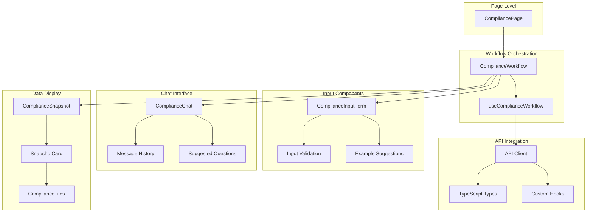

# Frontend Architecture - Integrated Compliance Workflow

## Overview

The integrated compliance workflow provides a seamless user experience that combines compliance analysis with context-aware chat functionality. This document outlines the frontend architecture and component structure.

## Component Architecture



## Core Components

### 1. ComplianceWorkflow (Main Orchestrator)

**Location:** `frontend/src/components/compliance/ComplianceWorkflow.tsx`

**Purpose:** Main orchestrator for the integrated compliance experience

**Key Features:**
- **Single source of truth** for the entire compliance workflow
- **State management** for inputs, compliance data, and chat messages
- **Context sharing** between compliance analysis and chat responses
- **Progressive disclosure** - chat appears after compliance data is loaded

**Props:**
```typescript
// No props - self-contained workflow
```

**State Management:**
```typescript
const {
  // Input state
  htsCode,
  laneId,
  setHtsCode,
  setLaneId,
  
  // Compliance data
  snapshot,
  snapshotLoading,
  snapshotError,
  fetchSnapshot,
  
  // Chat state
  chatMessages,
  chatLoading,
  sendChatMessage,
  clearChatHistory,
  
  // Integration state
  hasActiveQuery,
  lastQueryParams
} = useComplianceWorkflow();
```

### 2. ComplianceInputForm

**Location:** `frontend/src/components/compliance/ComplianceInputForm.tsx`

**Purpose:** Input form for HTS code and lane information

**Key Features:**
- **Real-time validation** for HTS codes and trade lanes
- **Example suggestions** to help users get started quickly
- **Accessible form design** with proper error handling
- **Loading states** during analysis

**Props:**
```typescript
interface ComplianceInputFormProps {
  initialHtsCode?: string;
  initialLaneId?: string;
  onSubmit: (htsCode: string, laneId: string) => Promise<void>;
  loading?: boolean;
}
```

**Validation Rules:**
- **HTS Code:** Format `/^\d{4,10}(\.\d{2}(\.\d{2})?)?$/` (e.g., 8517.12.00)
- **Lane ID:** Minimum 2 characters (e.g., CN-US)

### 3. ComplianceSnapshot

**Location:** `frontend/src/components/compliance/ComplianceSnapshot.tsx`

**Purpose:** Wrapper around SnapshotCard for the compliance workflow

**Key Features:**
- **Reuses existing SnapshotCard** component for consistency
- **Dynamic updates** based on user input
- **Error handling** and retry functionality

**Props:**
```typescript
interface ComplianceSnapshotProps {
  snapshot: ComplianceSnapshotType | null;
  loading: boolean;
  error: string | null;
  onRefresh: () => void;
}
```

### 4. ComplianceChat

**Location:** `frontend/src/components/compliance/ComplianceChat.tsx`

**Purpose:** Context-aware chat interface for compliance questions

**Key Features:**
- **Context-aware responses** using current compliance data
- **Suggested questions** based on compliance results
- **Message history** with compliance context indicators
- **Real-time typing indicators**

**Props:**
```typescript
interface ComplianceChatProps {
  messages: ChatMessage[];
  loading: boolean;
  onSendMessage: (message: string) => Promise<void>;
  onClearHistory: () => void;
  complianceContext?: ComplianceContext;
}

interface ComplianceContext {
  htsCode?: string;
  laneId?: string;
  hasData: boolean;
  riskLevel?: string;
}
```

## State Management

### useComplianceWorkflow Hook

**Location:** `frontend/src/hooks/useComplianceWorkflow.ts`

**Purpose:** Main hook for the integrated compliance workflow

**Key Responsibilities:**
- **Input state management** (HTS code, lane)
- **Compliance snapshot fetching** with error handling
- **Context-aware chat functionality**
- **Integration between compliance data and chat responses**

**Return Interface:**
```typescript
interface UseComplianceWorkflowReturn {
  // Input state
  htsCode: string;
  laneId: string;
  setHtsCode: (code: string) => void;
  setLaneId: (id: string) => void;
  
  // Compliance snapshot state
  snapshot: ComplianceSnapshot | null;
  snapshotLoading: boolean;
  snapshotError: string | null;
  fetchSnapshot: (params: SnapshotRequest) => Promise<void>;
  
  // Chat state
  chatMessages: ChatMessage[];
  chatLoading: boolean;
  sendChatMessage: (message: string, context?: ChatContext) => Promise<void>;
  clearChatHistory: () => void;
  
  // Integration state
  hasActiveQuery: boolean;
  lastQueryParams: SnapshotRequest | null;
}
```

## User Flow

### 1. Initial State
```typescript
// Clean slate - no data
hasActiveQuery: false
snapshot: null
chatMessages: []
showChat: false
```

### 2. User Input
```typescript
// User enters HTS code and lane
handleInputSubmit("8517.12.00", "CN-US")
  ↓
// Update input state
setHtsCode("8517.12.00")
setLaneId("CN-US")
  ↓
// Fetch compliance data
fetchSnapshot({
  client_id: 'default-client',
  sku_id: 'sku-8517.12.00',
  lane_id: 'CN-US',
  hts_code: '8517.12.00'
})
```

### 3. Compliance Analysis
```typescript
// Loading state
snapshotLoading: true
snapshotError: null
  ↓
// API call to backend
POST /compliance/snapshot
  ↓
// Success state
snapshotLoading: false
snapshot: { success: true, snapshot: {...} }
hasActiveQuery: true
```

### 4. Chat Activation
```typescript
// Auto-show chat when compliance data is available
useEffect(() => {
  if (snapshot && !showChat) {
    setShowChat(true);
  }
}, [snapshot, showChat]);
  ↓
// Add system message about compliance data
const systemMessage = {
  role: 'assistant',
  content: `I've analyzed the compliance data for HTS ${htsCode} on lane ${laneId}. 
           The overall risk level is ${riskLevel} with ${alertCount} active alerts. 
           Feel free to ask me any questions about these results!`,
  context: { htsCode, laneId, complianceData: true }
}
```

### 5. Context-Aware Chat
```typescript
// User asks question
handleChatMessage("What are the risks for this HTS code?")
  ↓
// Enhanced message with compliance context
const enhancedMessage = `
Current compliance context:
- HTS Code: ${htsCode}
- Trade Lane: ${laneId}
- Risk Level: ${riskLevel}
- Active Alerts: ${alertCount}
- Analysis Areas: ${tiles.join(', ')}

User question: What are the risks for this HTS code?
`;
  ↓
// Send to backend with context
sendChatMessageWithRetry({
  message: enhancedMessage,
  conversation_history: conversationHistory.current.slice(-10)
})
```

## API Integration

### Compliance API
```typescript
// Fetch compliance snapshot
const snapshot = await getComplianceSnapshotWithRetry({
  client_id: 'default-client',
  sku_id: `sku-${htsCode}`,
  lane_id: laneId,
  hts_code: htsCode
});

// Response structure
interface ComplianceSnapshot {
  success: boolean;
  snapshot?: {
    client_id: string;
    sku_id: string;
    lane_id: string;
    tiles: Record<string, Tile>;
    overall_risk_level: RiskLevel;
    risk_score: number;
    active_alerts_count: number;
    processing_time_ms: number;
    generated_at: string;
  };
  citations?: Evidence[];
  error?: string;
}
```

### Chat API
```typescript
// Send chat message with context
const response = await sendChatMessageWithRetry({
  message: enhancedMessage,
  conversation_history: recentHistory
});

// Response structure
interface ChatResponse {
  response: string;
  success: boolean;
  error?: string;
}
```

## Performance Optimizations

### React.memo Usage
```typescript
// Prevent unnecessary re-renders
export const ComplianceInputForm = React.memo(function ComplianceInputForm({...}) {
  // Component implementation
});

export const ComplianceChat = React.memo(function ComplianceChat({...}) {
  // Component implementation
});
```

### Optimized State Updates
```typescript
// Debounced input validation
const debouncedValidation = useCallback(
  debounce((hts: string, lane: string) => {
    validateInputs(hts, lane);
  }, 300),
  []
);

// Memoized context calculations
const complianceContext = useMemo(() => ({
  htsCode: lastQueryParams?.hts_code,
  laneId: lastQueryParams?.lane_id,
  hasData: !!snapshot,
  riskLevel: snapshot?.snapshot?.overall_risk_level
}), [lastQueryParams, snapshot]);
```

### Lazy Loading
```typescript
// Lazy load chat interface
const LazyComplianceChat = React.lazy(() => 
  import('./ComplianceChat').then(module => ({ 
    default: module.ComplianceChat 
  }))
);

// Render with Suspense
<Suspense fallback={<ChatSkeleton />}>
  <LazyComplianceChat {...chatProps} />
</Suspense>
```

## Error Handling

### Component-Level Error Boundaries
```typescript
// Wrap components in error boundaries
<ErrorBoundary fallback={<ComplianceErrorFallback />}>
  <ComplianceWorkflow />
</ErrorBoundary>
```

### API Error Handling
```typescript
// Standardized error handling
try {
  const result = await fetchSnapshot(params);
  setSnapshot(result);
} catch (err) {
  const errorMessage = err instanceof ApiError 
    ? err.message 
    : 'An unexpected error occurred';
  setSnapshotError(errorMessage);
}
```

### User-Friendly Error Messages
```typescript
// Context-aware error messages
const getErrorMessage = (error: ApiError, context: string) => {
  switch (error.type) {
    case 'network_error':
      return `Unable to ${context}. Please check your connection.`;
    case 'validation_error':
      return `Invalid input for ${context}. Please check your data.`;
    case 'server_error':
      return `Server error during ${context}. Please try again.`;
    default:
      return `Failed to ${context}. Please try again.`;
  }
};
```

## Accessibility Features

### Keyboard Navigation
- **Tab order:** Logical flow through form inputs and interactive elements
- **Enter/Space:** Activate buttons and submit forms
- **Arrow keys:** Navigate through suggested questions
- **Escape:** Close modals and clear focus

### Screen Reader Support
- **ARIA labels:** Descriptive labels for all interactive elements
- **ARIA live regions:** Announcements for loading states and errors
- **Semantic HTML:** Proper heading hierarchy and landmark roles
- **Focus management:** Proper focus handling during state changes

### Visual Accessibility
- **High contrast:** WCAG 2.1 AA compliant color ratios
- **Focus indicators:** Visible focus rings for keyboard users
- **Loading states:** Clear visual feedback during operations
- **Error states:** Distinct visual treatment for errors

This architecture provides a **cohesive, performant, and accessible** user experience that seamlessly integrates compliance analysis with intelligent chat functionality.