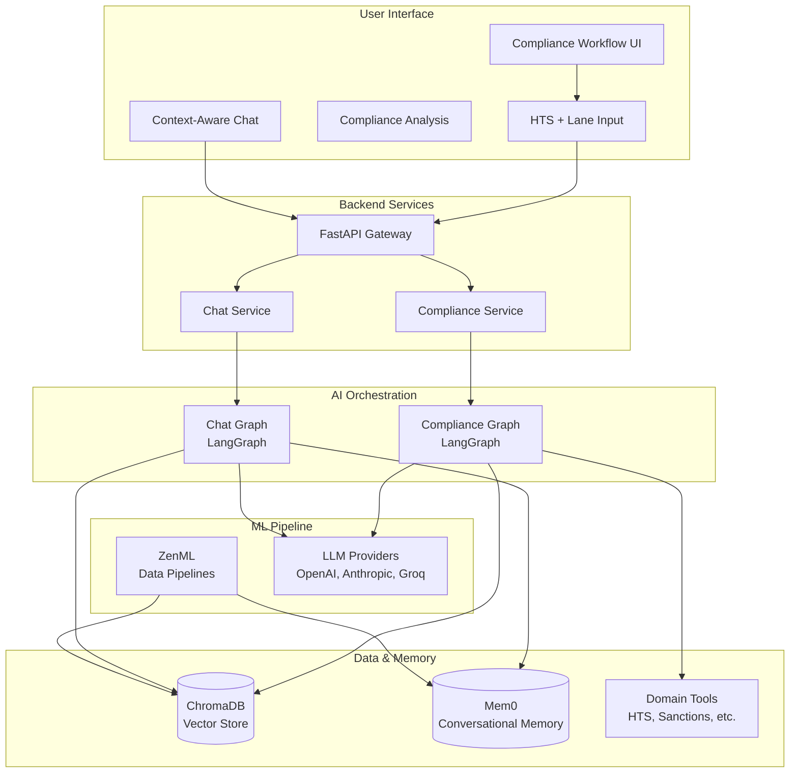

# Compliance Intelligence Platform - Documentation

## Overview

This documentation covers the integrated compliance workflow that combines real-time compliance analysis with context-aware chat functionality. The system provides a seamless user experience backed by sophisticated AI services including LangGraph, Mem0, ChromaDB, and ZenML.

## 📚 Documentation Structure

### Core Architecture
- **[Backend Integration Guide](./COMPLIANCE_INTEGRATION.md)** - Complete backend service integration flow
- **[Frontend Architecture](./FRONTEND_ARCHITECTURE.md)** - Frontend component structure and state management
- **[API Endpoints](./API_ENDPOINTS.md)** - Detailed API documentation with examples
- **[Deployment Guide](./DEPLOYMENT_GUIDE.md)** - Production deployment strategies

## 🎯 Quick Start

### For Developers
1. **Backend Integration** - Start with [COMPLIANCE_INTEGRATION.md](./COMPLIANCE_INTEGRATION.md) to understand how services connect
2. **Frontend Components** - Review [FRONTEND_ARCHITECTURE.md](./FRONTEND_ARCHITECTURE.md) for component structure
3. **API Usage** - Check [API_ENDPOINTS.md](./API_ENDPOINTS.md) for endpoint specifications

### For DevOps
1. **Deployment** - Follow [DEPLOYMENT_GUIDE.md](./DEPLOYMENT_GUIDE.md) for production setup
2. **Monitoring** - Review health check and observability sections
3. **Security** - Implement security recommendations from deployment guide

## 🏗️ System Architecture



## 🔄 Integration Flow

### 1. Compliance Analysis Flow
```
User Input (HTS + Lane) 
  → Compliance Service
  → LangGraph Orchestration
  → Domain Tools Execution
  → ChromaDB Document Retrieval
  → LLM Analysis & Tile Generation
  → Structured Compliance Response
```

### 2. Context-Aware Chat Flow
```
User Question + Compliance Context
  → Chat Service
  → LangGraph Orchestration
  → Mem0 Memory Retrieval
  → ChromaDB RAG Search
  → Context Fusion & Reranking
  → LLM Response Generation
  → Mem0 Memory Update
```

## 🚀 Key Features

### Integrated Workflow
- **Seamless Experience** - Single interface for compliance analysis and chat
- **Context Sharing** - Chat understands current compliance data
- **Progressive Enhancement** - Features appear as needed
- **Real-time Updates** - Live compliance analysis and chat responses

### AI-Powered Intelligence
- **LangGraph Orchestration** - Complex workflow management
- **Mem0 Memory** - Intelligent conversation history
- **Multi-LLM Support** - OpenAI, Anthropic, Groq providers
- **RAG Integration** - Document-grounded responses

### Enterprise Ready
- **Scalable Architecture** - Microservices with shared data layer
- **MLOps Integration** - ZenML for data pipeline management
- **Comprehensive Monitoring** - Health checks and observability
- **Security First** - Authentication, authorization, and data protection

## 📖 Detailed Documentation

### [Backend Integration Guide](./COMPLIANCE_INTEGRATION.md)
Comprehensive explanation of how the frontend connects to all backend services:
- **Compliance Graph Service** - HTS analysis, sanctions screening, refusal history
- **Chat Graph Service** - Context-aware conversational AI
- **ChromaDB Integration** - Shared vector storage for documents and memory
- **Mem0 Integration** - Intelligent conversational memory
- **ZenML Pipelines** - Data ingestion and model training workflows

### [Frontend Architecture](./FRONTEND_ARCHITECTURE.md)
Complete frontend component structure and state management:
- **Component Hierarchy** - ComplianceWorkflow orchestration
- **State Management** - useComplianceWorkflow hook
- **User Flow** - Step-by-step interaction patterns
- **Performance Optimizations** - React.memo, lazy loading, error boundaries

### [API Endpoints](./API_ENDPOINTS.md)
Detailed API documentation with request/response examples:
- **Compliance Endpoints** - `/compliance/snapshot`, `/compliance/ask`
- **Chat Endpoints** - `/chat` with context enhancement
- **Utility Endpoints** - Health checks, collection status
- **Error Handling** - Standardized error responses and retry logic

### [Deployment Guide](./DEPLOYMENT_GUIDE.md)
Production deployment strategies and configurations:
- **Docker Deployment** - Multi-container setup with docker-compose
- **Cloud Deployment** - AWS, GCP, and Kubernetes configurations
- **Monitoring & Observability** - Health checks, logging, metrics
- **Security & Backup** - Authentication, data protection, disaster recovery

## 🛠️ Development Workflow

### Local Development
1. **Backend Setup**
   ```bash
   # Install dependencies
   uv sync
   
   # Start services
   make start-project
   
   # Verify health
   curl http://localhost:8000/health
   ```

2. **Frontend Setup**
   ```bash
   cd frontend
   npm install
   npm run dev
   ```

3. **Integration Testing**
   ```bash
   # Test compliance workflow
   curl -X POST http://localhost:8000/compliance/snapshot \
     -H "Content-Type: application/json" \
     -d '{"client_id": "test", "sku_id": "test-sku", "lane_id": "CN-US", "hts_code": "8517.12.00"}'
   
   # Test chat integration
   curl -X POST http://localhost:8000/chat \
     -H "Content-Type: application/json" \
     -d '{"message": "What are the risks for HTS 8517.12.00?"}'
   ```

### Production Deployment
1. **Environment Configuration** - Set up production environment variables
2. **Container Build** - Build Docker images for backend and frontend
3. **Service Deployment** - Deploy using docker-compose or Kubernetes
4. **Health Verification** - Confirm all services are healthy
5. **Data Pipeline Setup** - Configure ZenML pipelines for data ingestion

## 🔍 Troubleshooting

### Common Issues

#### Backend Connection Issues
```bash
# Check service health
curl http://localhost:8000/health

# Verify ChromaDB
curl http://localhost:8000/compliance/collections/status

# Test LLM connectivity
curl -X POST http://localhost:8000/chat -d '{"message": "test"}'
```

#### Frontend Integration Issues
```bash
# Check API connectivity
curl http://localhost:3000/api/health

# Verify environment variables
echo $NEXT_PUBLIC_API_URL

# Check browser console for errors
```

#### Memory/Performance Issues
```bash
# Monitor memory usage
docker stats

# Check ChromaDB collection sizes
curl http://localhost:8000/compliance/collections/status

# Review application logs
docker logs compliance-backend
```

## 📞 Support

### Documentation Issues
- Create an issue in the repository for documentation improvements
- Include specific sections that need clarification
- Provide context about your use case

### Technical Issues
- Check the troubleshooting sections in each guide
- Review application logs for error details
- Verify environment configuration matches examples

### Feature Requests
- Describe the desired functionality
- Explain the business use case
- Consider integration with existing workflow

## 🔄 Updates

This documentation is maintained alongside the codebase. Key updates include:

- **v1.0** - Initial integrated compliance workflow
- **Backend Integration** - Complete service integration documentation
- **Frontend Architecture** - Component structure and state management
- **API Documentation** - Comprehensive endpoint specifications
- **Deployment Guide** - Production deployment strategies

For the latest updates, check the repository's main branch and release notes.

---

**Next Steps:** Start with the [Backend Integration Guide](./COMPLIANCE_INTEGRATION.md) to understand the complete system architecture, then review the [Frontend Architecture](./FRONTEND_ARCHITECTURE.md) to understand the user interface implementation.